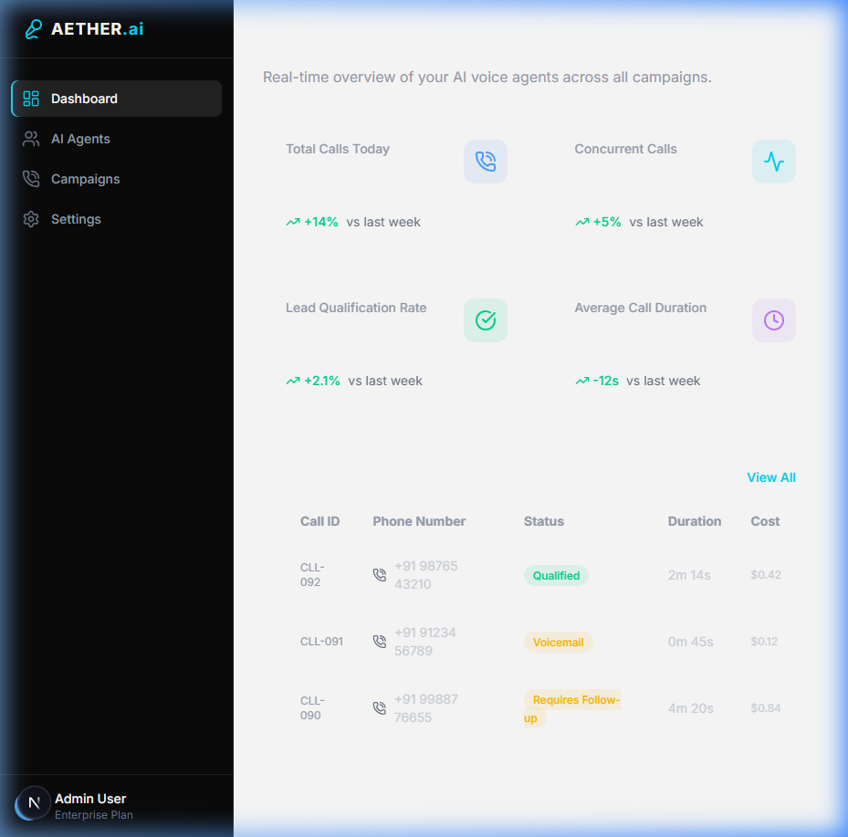
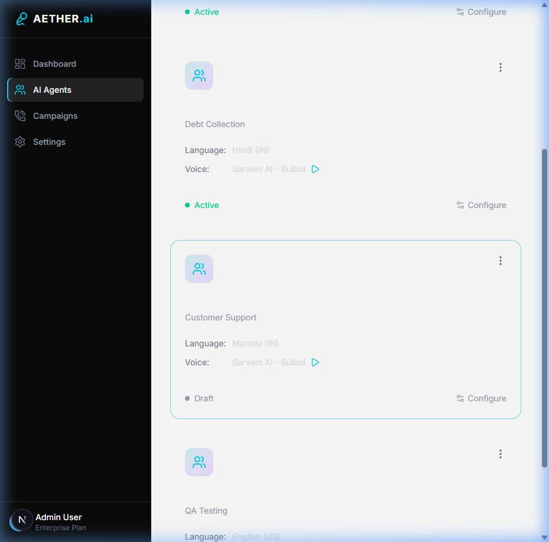
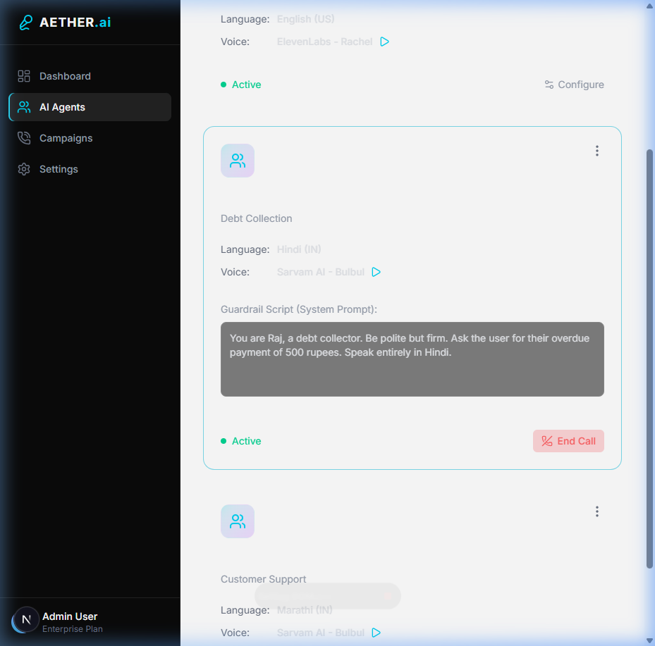

# Aether Voice Agents

Aether Voice Agents is a full-stack, real-time AI Voice Agent platform. It allows you to configure, test, and deploy AI voice personas that can conduct inbound and outbound calls seamlessly.

## Features
- **Real-Time AI Voice Streaming**: Built with WebSockets to handle ultra-low latency audio streams.
- **Agent Studio**: Configure agent roles, languages, voice engines, and custom guardrail prompts.
- **Campaign Manager**: Track live automated outbound calls with Call Detail Records (CDRs) and full LLM-generated transcripts.
- **Live Analytics Dashboard**: Real-time stats on call volumes, qualification rates, and call durations.
- **Mock Mode / Sandbox Testing**: Test your AI voice configurations directly in the browser via Web Audio without needing phone numbers.

### Agent Studio

### Live Test Calls

## Tech Stack
- **Frontend**: Next.js 14, React, Tailwind CSS, Lucide Icons
- **Backend**: Node.js, Express, SQLite (for CDR and Agent storage)
- **AI/Telephony Integrations**: Google Gemini (LLM), Sarvam AI (TTS), Deepgram (STT), Twilio (Telephony)

## Local Development Setup

### 1. Backend Setup
1. Navigate to the `backend` directory.
2. Install dependencies: `npm install`
3. Copy `.env.example` to `.env` and add your API keys (Gemini, Sarvam, Deepgram).
4. Start the server: `node index.js` (Server runs on port 3001 and initializes the SQLite DB).

### 2. Frontend Setup
1. Navigate to the `frontend` directory.
2. Install dependencies: `npm install`
3. Start the Next.js dev server: `npm run dev` (Runs on port 3000).

Visit `http://localhost:3000` to view the dashboard!

## License
MIT License
